```{r setup, include=FALSE}
library(knitr)
library(kableExtra)
knitr::opts_chunk$set(echo = TRUE, cache = F, fig.pos = "H", out.extra = "")
```

\newpage 

# 1 Abstract 

In the internet age, we have been given the luxury of endless streams of quickly accessible information. Although this data rate has allowed us to advance at an unprecedented rate the burden of sorting through what is true and what is not has grown for the consumer of information. This false information or "Fake News" has become increasingly prevalent. The task of sorting through this information is of a monumental scale, which is why many government institutions and organizations have applied AI to do such sorting in an effort to relieve some of the consumer burden. 

The organizers of the Fake News Challenge, an AI competition created to tackle this sorting problem, believe a helpful first step towards identifying fake news is to understand what other news organizations are saying about a topic. This process, called Stance Detection, could serve as a useful building block in an AI-assisted fact-checking pipeline. They provide a dataset with the goal of labeling whether a particular headline and article body agree, disagree, discuss each other, or are unrelated. A machine learning model should be able to differentiate between the labels. 

In this project we use the latest state of the art natural language algorithms to tackle this challenge. By incorporating these models as well as applying some clever thinking, we were able to both beat the baseline and winning scores of the competition. This paper describes the process of arriving to such a methodology. We discuss our research, data exploration, and experimentation that led us to the final methodology. 

# 2 Background 

## 2.1 Literature Review 

The FNC dataset has been available for some time, therefore there was a significant amount of previous work to explore and build off of for this project. Since the release of the FNC data in 2017 there has also been significant improvements in language model architecture for text classification tasks such as in this project. We used knowledge from this previous work to both experiment and refine our methodology and additionally incorporated some modern techniques and models into our work. 

We began by exploring the methodologies of those who had achieved the best competition scores and reading their respective papers that desdcribe their solutions. Papers with code is an excellent resource to explore the top papers and corresponding code for competition datasets [1]. The site provided us with the state of the art (SOTA) results for the FNC dataset. In Figure 1 we see that the best weighted accuracy result on this data was ~90%, with the rest of the pack achieving weighted accuracy results in the low 80's. 


```{r, echo=FALSE, fig.align = 'center', out.width="80%",out.height="45%", fig.cap="FNC All Time Best Results - Weighted Accuracy [1]"}
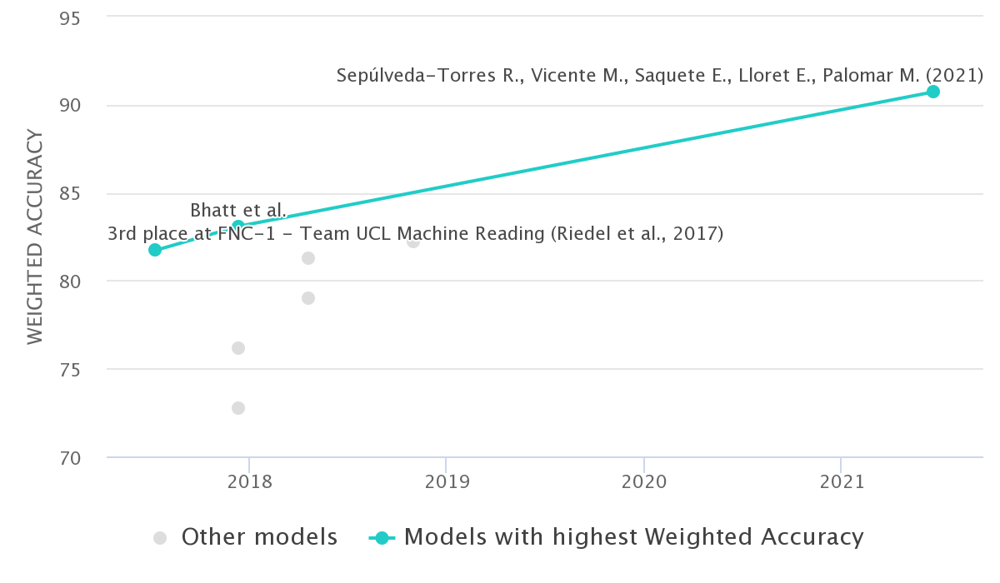
```

So what techniques did the competitors utilize to get them to the top of the leaderboard? Looking at the best result through the paper "Exploring Summarization to Enhance Headline Stance Detection" by Sepúlveda-Torres et. al. (2021), the authors use neural networks to first summarize the article bodies and used those along with the Headline to train a model to determine stance. It appeared that summarizing the articles reduced the text to key points, essentially removing the useless information that would confuse a later trained ML model [2]. The authors use neural networks throughout the pipeline for their models and take a two stage approach to generating predictions. The first stage used a model to determine if a headline is related or unrelated to a corresponding article body. The related posts then go to a second stage model to be further classified into agree, disagree, discuss. In the experiments section of this report, we'll describe our experience with this technique and whether or not it improved our results as well. Additionally we read the paper, "A simple but tough-to-beat baseline for the Fake News Challenge stance detection task" by Riedel et al. (2017), who happened to be the 3rd place team in the original FNC competition. Instead of typical tree-based methods that incorporate vectorizers and TFIDF to form the feature space of the examples, this paper utilizes word embeddings and neural networks to build out the training examples [3]. The relationships between words are richer with respect to the information they provide. A consequence of the weights being determined through previous training on very large corpuses of text data.  

In further exploring the literature we observed that the best approach with respect to choosing a model is to go with a modern neural network such as a transformer (BERT and it's related models). We'll experiment with summarization of the posts as well and observe any improvements to our modeling results.   

## 2.2 Exploratory Data Analysis 

To get a better sense of the data we were working with, we started this project with an exploratory data analysis of our text examples and their stance. We wanted to look for relationships and patterns that we could then spin into strategies for producing a model to predict stance. 

Given that this is a multi-class classification problem, we first observe the distribution of the unrelated, agree, disagree, discuss labels. In Figure 2, on the x-axis we have the specific class and on the y-axis we have the count of each class represented by the length of each bar. Above each bar is the percentage of the examples having the corresponding class label in the training dataset. 

```{r, echo=FALSE,out.width="49%", out.height="20%",fig.cap="FNC Training Data Class Label Distribution", fig.show='hold',fig.align='center'}
knitr::include_graphics(c("img/stance_dist_stg1.png","img/stance_dist.png"))
```

On the left bar diagram we see the breakdown between the related and unrelated examples. We observe that the training dataset is imbalanced in favor of the unrelated class. On the right we see the further breakdown of the related examples into agree, disagree, and discuss classes. Again the diagram on the right proves that the imbalanced classification problem persists when we break things down further. Given the distribution of the labels it appears that the best strategy would to break the stance classification problem into two stages to help with the imbalance. A first stage model will classify examples into unrelated and related buckets, and another model will classify the related posts into agree, disagree, discuss buckets. Here on, we'll refer to the two parts of the classification methodology as stage 1 and stage 2 respectively.  

First focusing on stage 1, we wanted to determine what aspects of language relate a headline to an article body. What makes them related? What makes them unrelated? We studied this and came to an interesting conclusion. Using the two examples in Figure 3 we can explain our discovery. 

```{r, echo=FALSE, fig.align = 'center', out.width="100%",out.height="100%", fig.cap="Unrelated - Related Examples"}
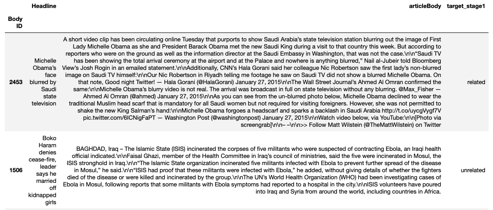
```

The first row is a related example. So what is the link between the two? Interestingly, what links the two is the nouns that are common between the headline and the article body! The nouns Michelle Obama, Saudi, link these two pieces of text. Likewise, the second row contains an unrelated example. There are no common nouns between the headline and the body, one is discussing a Boko Haram event, the other an Iraq event. Obviously the two are unrelated, but the nouns mentioned are the key words determining this link! Given the success of this first analysis we moved on to Stage 2 with the goal of determining what makes a headline and article body agree, discuss, or disagree with each other. We visualize some examples in Figure 4.  

```{r, echo=FALSE, fig.align = 'center', out.width="100%",out.height="100%", fig.cap="Agree, Disagree, Discuss Examples"}
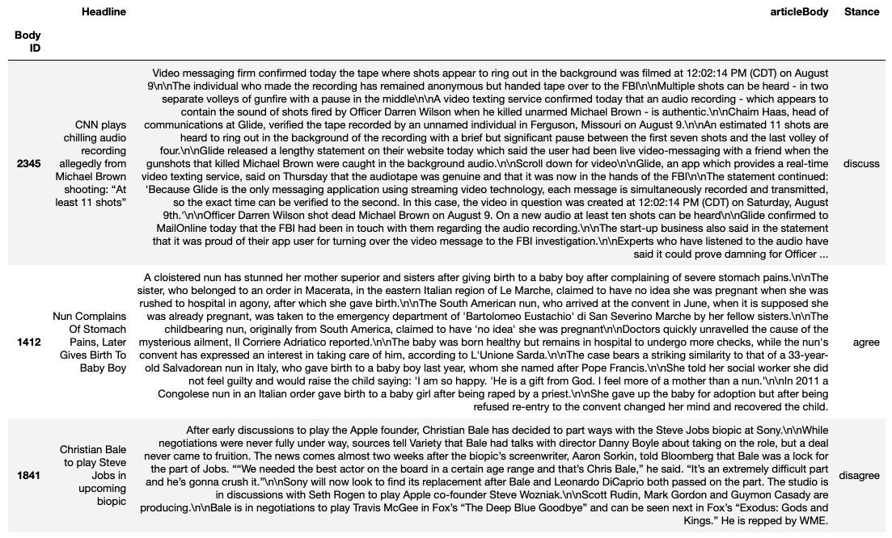
```

Unlike with the first stage targets the pattern is not clear. There is likely a more complicated underlying function that determines the classes in this case. We'll likely have to use a more advanced model for this stage. 

# 3 Methodology 

## 3.1 General Approach 

As previously stated we took a two stage approach to this classification problem. We treat the first stage as a binary classification problem, classifying article and headline pairs as either related or unrelated. The second stage is treated as a multi-class classification problem taking as input the article/body pairs that were labelled related in stage 1 and then classifying them as either in agreement, disagreement or discussed. Figure 5 illustrates this flow along with the intermediate steps. 

```{r, echo=FALSE, fig.align = 'center', out.width="80%",out.height="50%", fig.cap="Methodology Flow"}
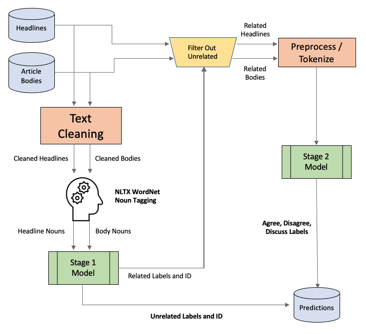
```

## 3.2 Stage 1 

In stage 1 we opted for a less than traditional approach to solve this binary classification problem. Typically we would throw a transformer model at the problem and fine-tune it on our dataset and get relatively good results without much effort (when we tried this we achieved 92% accuracy out of the gate without much work). Using a "model-free" approach (methodology) we can actually do a lot better and become competitive with the SOTA models from the literature review. We decided that this approach would be more interesting/enjoyable to try, something to differentiate our group from the current methodologies. As shown in section 5 of this report, we were quite succesful using it. 

In our EDA we learnt that nouns (ex. hat, boy, mother), proper nouns (ex. Karen, Canada), and sometimes numbers give a strong signal on whether or not a headline/body pair are related. In our approach we only keep these nouns and throw away everything else. We use NLTK's WordMet and entity recognition to do this tagging, removal of non nouns, stemming and lemmatization. We noticed that special characters ($,#,%) can get picked up in the tagging process so we remove them in a text cleaning step before preforming the tagging. Figures 6 and 7 show examples of the end of this process. We can observe that nouns and numbers are what remains in the variables headline_ents and body_ents. 

```{r, echo=FALSE, fig.align = 'center', out.width="100%",out.height="100%", fig.cap="Noun Tagging - Headline"}
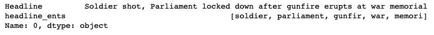
```

```{r, echo=FALSE, fig.align = 'center', out.width="100%",out.height="100%", fig.cap="Noun Tagging - Body"}
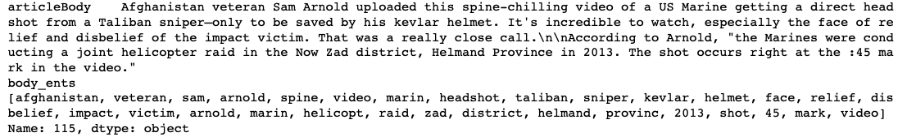
```

Now that we have retrieved the nouns we need some way to compare the two sets of nouns for similarity. We had a few options to compute the scores, however, the simplest option the Jaccard Similarity Index [3] proved to yield the strongest signal regarding the relation between a headline and body. The Jaccard index, also known as the Jaccard similarity coefficient, is a statistic used for gauging the similarity and diversity of sample sets, yielding a value between 0 (no common set elements) and 1 (the sets are exact copies). For our task we are essentially counting the number of shared nouns normalized by the size of the total set of nouns. The Jaccard index between a headline (A) and body (B) is calculated using the following equation: \ 

$$J(A,B) = \frac{|A \cap B |}{|A \cup B|}$$ \

When first experimenting with this methodology we were hoping to observe two distinct groups of Jaccard scores. A group of higher Jaccard scores corresponding to the examples labeled related and another group of lower Jaccard scores corresponding to the unrelated examples. Observing Figure 8 we got exactly what we were looking for! We observe two distinct groups with little overlap. 

```{r, echo=FALSE, fig.align = 'center', out.width="100%",out.height="100%", fig.cap="Distribution of Jaccard Scores Training Set"}
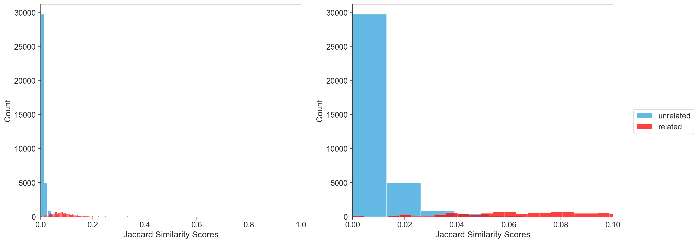
```

This provides evidence that we can perform the labeling task in stage 1 using a model free threshold line. All we have to do is optimize the location of this line by maximizing accuracy on the training data! Observing the right subplot of Figure 8, we might want to place this line around 0.04 for example. Anything greater than the threshold line getting the label related, else unrelated. We can further optimize the Jaccard scoring by optimizing the number of nouns that we include in the scoring. We place this cap on the article body because typically we find more nouns. We found that optimizing this number improved predictive accuracy of the model free approach and therefore include it as a parameter in the flow diagram illustrated in Figure 9. Details on accuracy of this stage 1 approach are included in section 5 of this report. 

```{r, echo=FALSE, fig.align = 'center', out.width="50%",out.height="50%", fig.cap="Stage 1 Flow"}
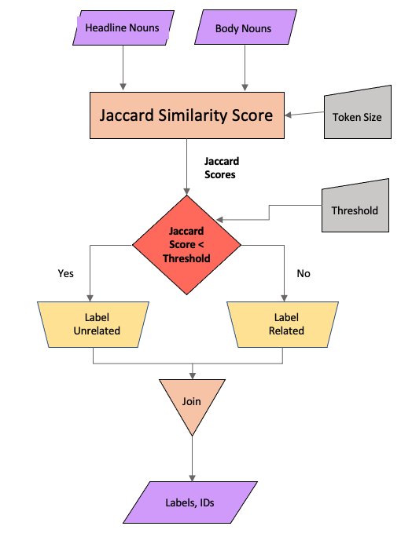
```

## 3.3 Stage 2 

As stated in the EDA section of this report, the complexity of the multi-class stage 2 labeling problem had us move away from the interesting model free approach of stage 1 to a model based approach in stage 2. To harness the power of transfer learning and enable quick experimentation our group utilized the HuggingFace Transformers library to develop our model. Through experimentation we found the RoBERTa model to provide the best results on the given test set. RoBERTa [4] is generally the same as the BERT discussed in class with better pretraining tricks [5]:

* dynamic masking: tokens are masked differently at each epoch, whereas BERT does it once and for all
* no NSP (next sentence prediction) loss and instead of putting just two sentences together, put a chunk of contiguous texts together to reach 512 tokens (so the sentences are in an order than may span several documents)
* train with larger batches
* use BPE with bytes as a subunit and not characters (because of unicode characters)

RoBERTa is quite large so we won't display it's architecture here. Details can be found on the HuggingFace model repository. We fine-tuned a pretrained RoBERTa model for sequence classification on our training dataset with the following parameters: 

```{r, echo=FALSE, fig.align = 'center', out.width="80%",out.height="80%", fig.cap="RoBERTa Training Arguements"}
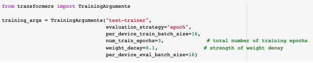
```

The HuggingFace library provides a useful API to tokenize multi-text inputs! Pre-tokenization we cleanup the special characters in the text examples. The tokenization strategy given that we have two text inputs produces the output show in Figure 11. Sentence 1 representing the headline, sentence 2 the article body.  

```{r, echo=FALSE, fig.align = 'center', out.width="80%",out.height="80%", fig.cap="Tokenization [6]"}
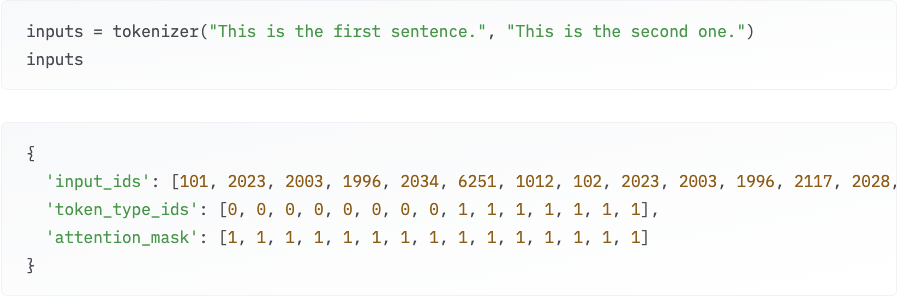
```

We see how the token_type_ids indicate which piece of text the tokens belong to. The flowchart in Figure 12 summarizes the stage 2 process. 

```{r, echo=FALSE, fig.align = 'center', out.width="30%",out.height="40%", fig.cap="Stage 2 Flow"}
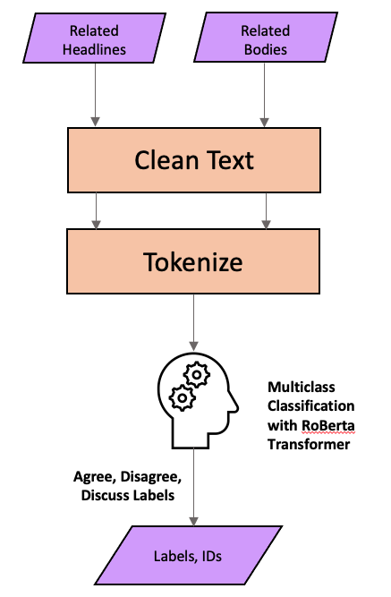
```

# 4 Experiments 

## 4.1 Stage 1 Optimizations 

Noun tagging proved to be expensive computationally because of the size of the FNC dataset. Optimization were performed on a sample of 1000 from the training dataset. Results were computed on the provided training set and decisions were made with respect of the methodologies performance on it. Due to this methodology being model free, statistically there's no need to look at the performance on a separate test set. Train is essentially test in this case because there is no fitting process. NLTK's entity recognition feature allowed us to specifically pick up different noun categories [7]. The list included: 


>'PERSON','NORP','FAC','ORG','GPE','LOC','PRODUCT','EVENT','WORK_OF_ART',
'LAW','LANGUAGE','DATE','MONEY', 'NOUN','PROPN','NUM' 

Details on what each specific noun tag refers to can be found in the data dictionary at Reference 7 in this report. We first optimized which set of categories chosen resulted in the best test set performance. The search space would be too large to try all possible combinations so we picked six combinations that we thought would be comprehensive. The results are presented in Table 1.

```{r, echo=FALSE}
trial <- c(1,2,3,4,5,6)
noun_types <- c('NOUN',
                'NOUN, PROPN',
                'NOUN, PROPN, NUM',
                'NOUN, PROPN, NUM, ORG, DATE',
                'PERSON, NORP, FAC, ORG, GPE, LOC, PRODUCT, EVENT, 
                 WORK_OF_ART, LAW, LANGUAGE, DATE, MONEY',
                'PERSON, NORP, FAC, ORG, GPE, LOC, PRODUCT, EVENT,
             WORK_OF_ART, LAW, LANGUAGE, DATE, MONEY, NOUN, PROPN, NUM')
recall_related <- c(76.8,94.2 , 91.7 ,93.8 , 72.1 ,95.2 )
recall_unrelated <- c(90.1, 95.6, 95.9 , 95.9 ,95.1 ,94.9 )
acc <- c(86.5,95.2 ,94.7 ,95.3,86.8 ,95.0)
results <- data.frame(
  trial, 
                      noun_types,
                      recall_related, 
                      recall_unrelated, 
                      acc
                      )
columns <- c('Trial #','Noun Types Included', 'Recall-Related (%)',
                     'Recall-Unrelated (%)', 'Accuracy (%)')

options(knitr.table.format = "latex")

x <- kableExtra::kable(results, col.names =columns,caption = "Stage 1 Tag Optimization")  %>%
  kable_styling(position = "center", latex_options = "HOLD_position")
column_spec(x, 2,width="5cm" )
```

It's clear by Table 1 that having nouns and proper nouns was essential. Including dates, organizations and numbers boosted the accuracy slightly. Lemmatization and stemming were used on the nouns in the first case. We wanted to determine if performance changed without incorporating these techniques (lem and stem). The results of these next trials are shown in Table 2. 

```{r, echo=FALSE}
trial <- c(1,2,3,4)
aug_types <- c('None', 'Stemming', 'Lemming', 'Lem and Stem')
recall_related <- c(90.2, 93.8, 92.7,93.8 )
recall_unrelated <- c(93.8 ,96.0, 96.1 ,95.9  )
acc <- c(92.8, 95.4 , 95.2 ,95.3)
results <- data.frame(
  trial, 
                      aug_types,
                      recall_related, 
                      recall_unrelated, 
                      acc
                      )
columns <- c('Trial #','Augmentation Technique (%)', 'Recall-Related (%)',
                     'Recall-Unrelated (%)', 'Accuracy (%)')

options(knitr.table.format = "latex")

x <- kableExtra::kable(results, col.names =columns,caption = "Stage 1 Word Augmentation Optimization")  %>%
  kable_styling(position = "center", latex_options = "HOLD_position")
column_spec(x, 2,width="2cm" )
```

We can see that only using stemming leads to the optimal result. Additionally, we wanted optimize the placement of the threshold line and not just "eyeball it" to maximize classification accuracy in this stage. We use the SciPy library's optimization feature to do so and call this threshold placement objective_a. Additionally, we want to maximize accuracy according to the number of nouns we allow into the Jaccard score from the article bodies. We call this objective_b. Figure 13 displays these functions as implemented in python code. 

```{r, echo=FALSE,out.width="100%", out.height="100%",fig.cap="Stage 1 Objective Functions", fig.show='hold',fig.align='center'}
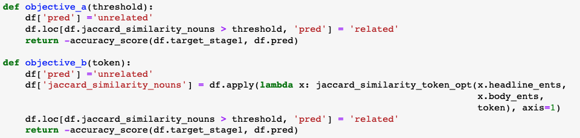
```

In our experiments, we saw on average a 1% bump in accuracy on the training set attributed to each optimization (~2% gain total). 

## 4.2 Stage 2 Optimizations 

The results in this section were calculated on the test set provided by the FNC competition, NOT on a sample of the training set as in section 4.1. Over the course of these experiments we keep the training parameters consistent with those shown in Figure 10. We note that keeping weight decay higher leads to increased accuracy but we did not fully investigate this parameter in this project.  

In an effort to match the performance by Sepúlveda-Torres et. al. (2021) we used the RoBERTa transformer model to first summarize the article bodies before training on them then predicting on the test set provided by the competition. We did not see improved performance, rather we saw a 4% drop in accuracy from our groups stage 2 baseline. Given the drop in performance we will not be providing those results in this section. 

Given the label distribution shown in Figure 2, we knew immediately that class imbalance would prove to be an issue. To overcome this typical classification problem we applied oversampling and undersampling techniques to the training data. We first trained a baseline model using BERT on the full training dataset. Subsequently, we tried undersampling by reducing the discuss examples to 4000 so that the class distribution would be more even but still resemble the training data slightly. Following this we attempted to oversample the minority class (disagree label) by doubling the number of training examples corresponding to it (increasing from ~1000 to ~2000). The oversampling strategy we used involved using the NLPAug python library to change words at random within an example, replacing the chosen word(s) with it's synonym. We used a Bernoulli trial to determine whether the headline should be augmented or the article body. Finally we tried a combination of oversampling the minority class (disagree, doubling) and undersampling the majority class (discuss, reducing to 4000 rows, synonym augmentation). Table 4 presents the results of these trials.   

```{r, echo=FALSE}
trial <- c(1,2,3,4)
sampling_types <- c('None', 'Undersampling', 'Oversampling', 'Oversampling and Undersampling')
recall_agree <- c(76.0, 76.0, 64, 76 )
recall_disagree<- c(14.0, 45.0, 43, 30 )
recall_discuss <- c(88.0, 82.0, 88, 84)
acc <- c(78.0, 77, 77, 76)
results <- data.frame(
                      trial, 
                      sampling_types,
                      recall_agree, 
                      recall_disagree, 
                      recall_discuss, 
                      acc
                      )
columns <- c('Trial #','Sampling Strategy', 'Recall-Agree (%)', 'Recall-Disagree (%)', 'Recall-Discuss (%)', 'Accuracy')

options(knitr.table.format = "latex")

x <- kableExtra::kable(results, col.names =columns,caption = "Stage 2 Data Optimization")  %>%
  kable_styling(position = "center", latex_options = "HOLD_position")
column_spec(x, 2,width="3cm" )
```

From this first experiment we see at least a 1% drop in accuracy when applying any of the sampling strategies outlined. Although there is a small drop in accuracy, oversampling seems to balance the recall a bit better across all classes. We suggest then using the oversampling strategy in favor of getting more disagree values correct at the small expense of the other classes.  

Without oversampling, we experimented with several model types as many are available on the HuggingFace repository. Each has various strengths as described in the literature which is why we decided to try them out. We fine-tuned 3 pretrianed model architectures, specifically distil-bert, know for being a light weight BERT model thus making training quicker, BERT, the original transformer, and RoBERTa a popular extension of the original BERT model. Table 4 presents the results of these trials. 

```{r, echo=FALSE}
trial <- c(1,2,3)
model_types <- c('distil-bert', 'BERT', 'RoBERTa')
recall_agree <- c(68.0, 76.0 ,77.0)
recall_disagree<- c(7.0, 14.0 ,31.0)
recall_discuss <- c(85.0, 88.0 ,89.0)
acc <- c(72.2, 78.0, 80)
results <- data.frame(
                      trial, 
                      model_types,
                      recall_agree, 
                      recall_disagree, 
                      recall_discuss, 
                      acc
                      )
columns <- c('Trial #','Model Type', 'Recall-Agree (%)',
                     'Recall-Disagree (%)', 'Recall-Discuss (%)', 'Accuracy')

options(knitr.table.format = "latex")

x <- kableExtra::kable(results, col.names =columns,caption = "Stage 2 Model Optimization")  %>%
  kable_styling(position = "center", latex_options = "HOLD_position")
column_spec(x, 2,width="2cm" )
```

# 5 Conclusion 

## 5.1 Results 

### 5.1.1 Test Set Results 

In this section we present the results of our methodology on the competition test set. Beginning with the first stage, in Table 5 we present the optimized stage 1 parameters for the threshold line (used to classify given Jaccard score input) and the max number of article nouns used (token size) in calculating the Jaccard score. 

```{r, echo=FALSE}
model_types <- c(0.02386085645671562)
trial <- c(68)
results <- data.frame(
                      trial, model_types
                      )
columns <- c('# Nouns (Token Size)', 'Jaccard Threshold Line') 

options(knitr.table.format = "latex")

x <- kableExtra::kable(results, col.names =columns,caption = "Stage 1 Parameters")  %>%
  kable_styling(position = "center", latex_options = "HOLD_position")
column_spec(x, 1:2,width="4cm" )
```

We can visualize the threshold line along with the Jaccard scores in Figure 14. We see the training distribution of Jaccard scores in Figure 8 closely resembles those of 14. Hence we have a methodology that works out of sample!

```{r, echo=FALSE,out.width="100%", out.height="100%",fig.cap="Jaccard Scores Test and Threshold Classification Line", fig.show='hold',fig.align='center'}
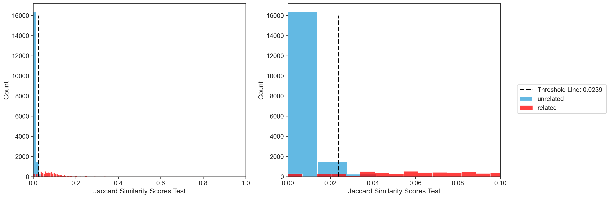
```

The stage 2 model parameters were presented in section 3 and have not changed. In Figure 15 we visualize the confusion matrices of stage 1 on the left, followed by stage 2 on the right. We computed the stage 2 confusion matrix using only the posts that made it into stage 2 from stage 1 (those labeled related). There was some error in the first stage thus not all true related test examples made it through to stage 2. The confusion matrices displayed contain two metrics in each cell, the first number being the count of examples falling into the cell, the second number being a percent proportion of this count with respect to the dataset. If you were to add this second number along the main diagonal you would arrive at the total accuracy on the corresponding test set. 

```{r, echo=FALSE,out.width="35%", out.height="35%",fig.cap="Confusion Matrices, Stages 1 and 2", fig.show='hold',fig.align='center'}
knitr::include_graphics(c("img/cf_1.png","img/cf_2.png"))
```

We aggregate these results to form the overall confusion matrix shown in Figure 16 and tabulate the class by class accuracy in Table 6. We also use the FNC competition's scorer function to calculate our methodologies' weighted accuracy on the test set and add this to Table 6. 

```{r, echo=FALSE,out.width="50%", out.height="50%",fig.cap="Confusion Matrix, Overall Results", fig.show='hold',fig.align='center'}
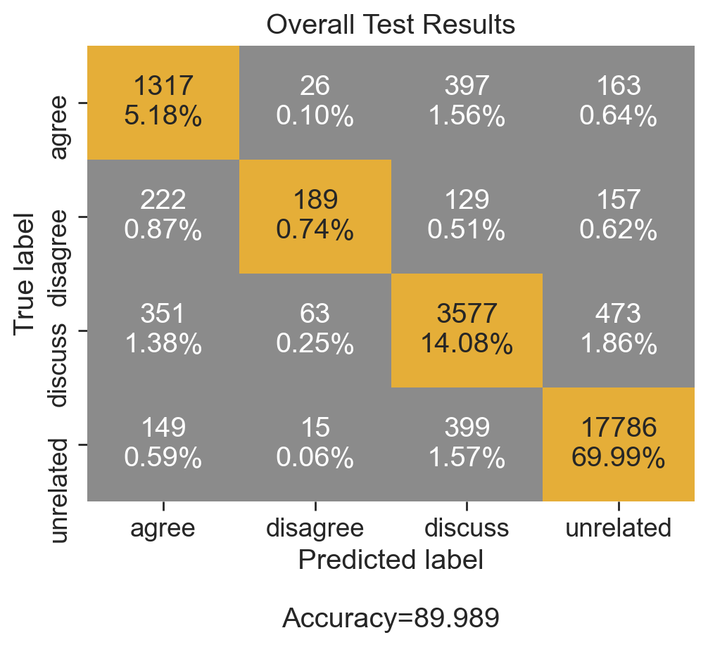
```

```{r, echo=FALSE}

results <- data.frame(
                      c(0.692*100),                      
                      c(0.271*100),
                      c(0.801*100),
                      c(0.969*100),
                      c(0.899*100),
                      c(84.34),
                      c(9826.5)                      
                      )
columns <- c('Recall-Agree (%)', 'Recall-Disagree (%)', 
             'Recall-Discuss (%)', 'Recall-Unrelated (%)', 'Accuracy (%)', 'FNC Weighted Accuracy','FNC Score')

options(knitr.table.format = "latex")

x <- kableExtra::kable(results, col.names =columns,caption = "Overall Test Results, Metrics")  %>%
  kable_styling(position = "center", latex_options = "HOLD_position")
column_spec(x, 1:7,width="2cm" )
```
### 5.1.2 Comparison to SOTA 

We can conclude that our overall approach is quite competitive within even the SOTA approaches. Tabulating the top 3 competitors from papers with code, along with our model shown in comparison produces Table 7. Our results are presented in bold along with the new ranking (by FNC weighted accuracy) with the addition of our approach [1]. 

```{r, echo=FALSE}
results <- data.frame(c(1, 2, 3, 4), 
                      c('Sepúlveda-Torres R., Vicente M., Saquete E., Lloret E., Palomar M.',
                        'Our Approach', 
                        'Bhatt et al.', 
                        'Bi-LSTM'
                        ),
                      c(75.03, 0.692*100, 43.82, 51.54),                      
                      c(63.41, 0.271*100, 6.31, 10.33),
                      c(85.97, 0.801*100, 85.68, 81.52),
                      c(99.36, 0.969317*100, 98.04, 96.74),
                      c(90.73, 84.34, 83.08, 82.23)
                      )
columns <- c('Rank', 'Team/Model', 'Recall-Agree (%)', 'Recall-Disagree (%)', 
             'Recall-Discuss (%)', 'Recall-Unrelated (%)', 
              'FNC Weighted Accuracy')

options(knitr.table.format = "latex")

kableExtra::kable(results, col.names =columns,caption = "Overall Test Results, Metrics")  %>%
  kable_styling(position = "center", latex_options = "HOLD_position") %>% 
  row_spec(2, bold = TRUE) %>% 
  column_spec(2:7,width="2cm" )
```

Our performance in the stage compared to those of the second and third place papers vaults our approach to second place in the rankings. We do quite well in the unrelated column as well, however this is scored less in the competition so increasing recall of the 'related' label in the first stage helped us in the second stage. More opportunity to get labels right here. We are quite proud of our approach, using no model for the first stage and limited time spent tuning RoBERTa in the second stage. We took advantage of statistics (oversampling) in the second stage only, and used our knowledge of the English language in the first stage to develop a simple methodology.

### 5.1.3 Error Analysis

So what kind of examples did our model miss? Why did we get things wrong? We noticed in the first stage that our method struggled with examples that had short headlines (< 4 word). There just wasn't enough nouns to calculate a proper Jaccard score. There were several of these with a 0 Jaccard score that should have been related but were labeled unrelated. That being said, we believe that it would be difficult for a human to distinguish between some of these as well without proper context such as an article link. Observing the confusion matrix of stage 2, agree and discuss examples are confused a lot. This might be do to similar language and semantics, the article or headline being vague. Disagree examples are most confused with agree labels which is interesting. We would think that disagree and agree examples should be both most confused with discuss examples but this is not the case. The model could be focused on the nouns mentioned instead of the context. There are ways to add context to transformer models, however this would require future work.

## 5.2 Recommendations for Future Work 

To conclude this report, our group clearly achieved some excellent results given our hybrid modeling approach. We presented a novel method for the stage 1 portion of the classification not seen in the current literature for the FNC dataset. This stage was competitive with some of the top models consisting of advanced architectures. It was interesting to observe that simple calculations with the knowledge of a pattern could beat these other methods. In the future it would be interesting for someone to extend the Jaccard calculation into a weighted score. Weighting certain type of nouns more than others to compute the score. For example, if the same person let's say Michelle Obama was tagged in both the article body and headline, these two texts are most likely related. Adding some weight to names would be interesting to boost Jaccard in some instances and really separate those distributions more from Figures 8 and 14. Theoretically this would make the thresholding task easier. Additionally we could likely ensemble this stage with a transformer based model. Typically ensembeling increases classification accuracy thus this could be an interesting next step experiment.

With respect to stage 2, we did not spend much time optimizing the model hyperparameters nor the hyperparameters of the oversampling method in training. The others of the first ranked paper did optimize their models heavily which gave them quite a great score. If our group had more GPU resources at our disposal we could likely do the same and get closer to the top rank.   

\newpage 

# 6 References 

[1] https://paperswithcode.com/sota/fake-news-detection-on-fnc-1 \
[2] https://link.springer.com/chapter/10.1007/978-3-030-80599-9_22 \
[3] https://scikit-learn.org/stable/modules/generated/sklearn.metrics.jaccard_score.html#:~:text=Jaccard%20similarity%20coefficient%20score.,set%20of%20labels%20in%20y_true%20. \
[4] https://arxiv.org/abs/1907.11692 \
[5] https://huggingface.co/docs/transformers/model_summary \
[6] https://huggingface.co/course/chapter2/4?fw=pt \
[7] https://pahulpreet86.github.io/name-entity-recognition-pre-trained-models-review/ \
